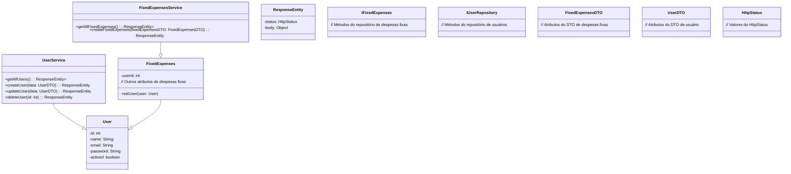

# budgetBuddy
BudgetBuddy

```mermaid
classDiagram
    class UserService {
        +getAllUsers(): ResponseEntity<List<User>>
        +createUser(data: UserDTO): ResponseEntity
        +updateUser(data: UserDTO): ResponseEntity
        +deleteUser(id: int): ResponseEntity
    }

    class FixedExpensesService {
        +getAllFixedExpenses(): ResponseEntity<List<FixedExpenses>>
        +createFixedExpenses(fixedExpensesDTO: FixedExpensesDTO): ResponseEntity
    }

    class ResponseEntity {
        -status: HttpStatus
        -body: Object
    }

    class IFixedExpenses {
        // Métodos do repositório de despesas fixas
    }

    class IUserRepository {
        // Métodos do repositório de usuários
    }

    class FixedExpensesDTO {
        // Atributos do DTO de despesas fixas
    }

    class UserDTO {
        // Atributos do DTO de usuário
    }

    class User {
        -id: int
        -name: String
        -email: String
        -password: String
        -actived: boolean
    }

    class FixedExpenses {
        -userId: int
        // Outros atributos de despesas fixas
        +setUser(user: User)
    }

    class HttpStatus {
        // Valores do HttpStatus
    }

    UserService --|> User
    FixedExpensesService --|> FixedExpenses
    FixedExpenses --|> User
```
