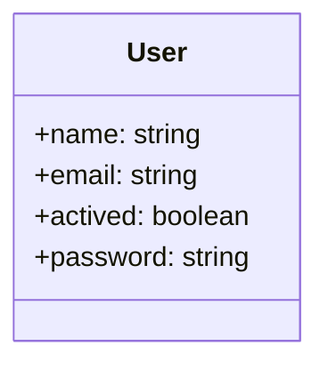
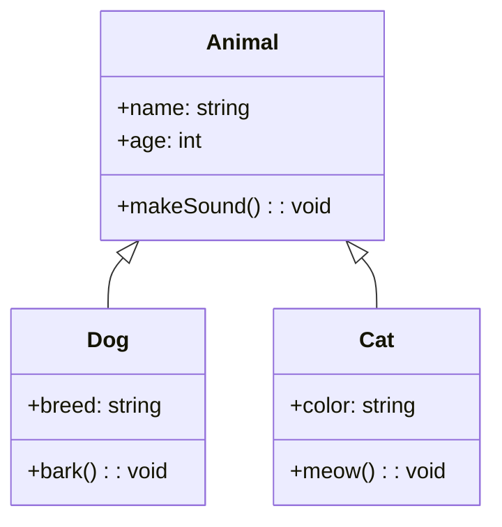

# budgetBuddy
BudgetBuddy

```mermaid
classDiagram
 
  class User{
    +name: string
    +email: string
    +actived: boolean
    +password: string
  }
 
 
```

```mermaid
classDiagram
    class Animal {
        +name: string
        +age: int
        +makeSound(): void
    }
    class Dog {
        +breed: string
        +bark(): void
    }

    class Cat {
        +color: string
        +meow(): void
    }

    Animal <|-- Dog
    Animal <|-- Cat
```