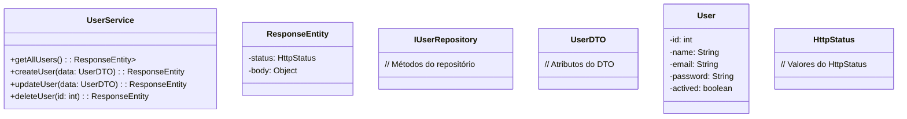

# budgetBuddy
BudgetBuddy

```mermaid
classDiagram
    class UserService {
        +getAllUsers(): ResponseEntity<List<User>>
        +createUser(data: UserDTO): ResponseEntity
        +updateUser(data: UserDTO): ResponseEntity
        +deleteUser(id: int): ResponseEntity
    }

    class ResponseEntity {
        -status: HttpStatus
        -body: Object
    }

    class IUserRepository {
        // Métodos do repositório
    }

    class UserDTO {
        // Atributos do DTO
    }

    class User {
        -id: int
        -name: String
        -email: String
        -password: String
        -actived: boolean
    }

    class HttpStatus {
        // Valores do HttpStatus
    }
 
```
